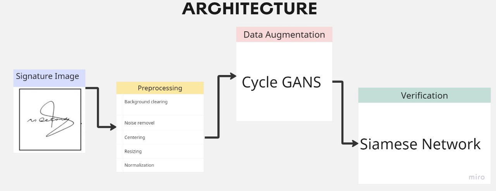
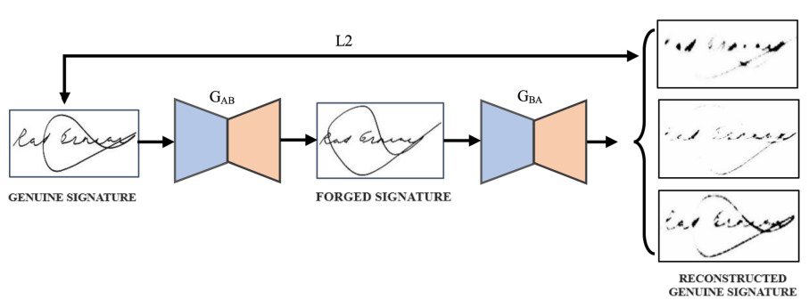
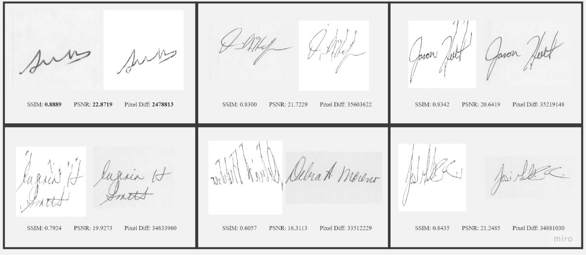
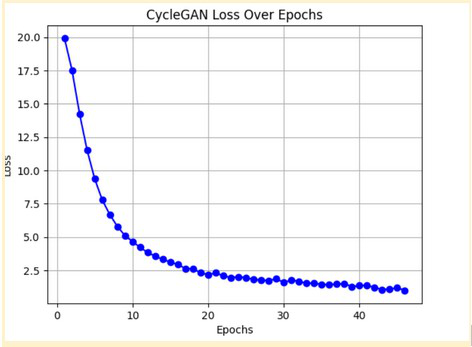
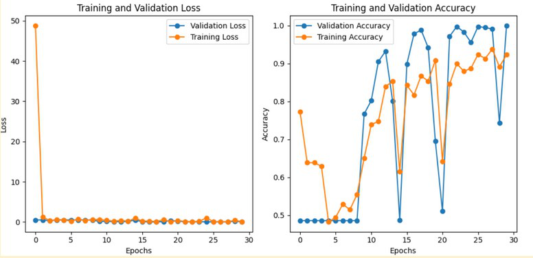
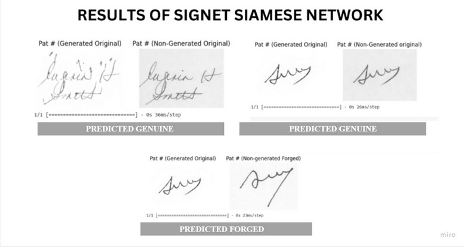
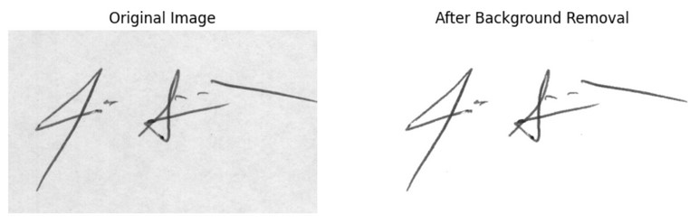
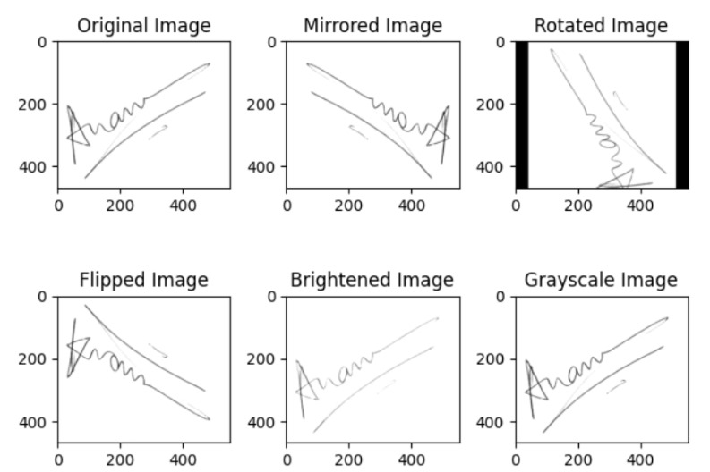

# Offline Signature Verification System through GAN Data Augmentation

> Improving offline handwritten signature verification by generating realistic synthetic signatures with **Cycle-GAN**, then verifying them with a **Siamese SigNet** network — lifting accuracy from **90% → 93%** on the CEDAR dataset.

<p align="left">
  
  
  
  
  
</p>

---

## 📌 Overview

Offline signature verification systems are limited by **data scarcity** — public datasets contain only a handful of genuine signatures per writer, which is not enough to train robust deep models.

This project tackles that problem with a **generative data augmentation pipeline**:

1. **Preprocess** signature images (background removal via GrabCut, centering, resizing, normalization)
2. **Augment** the dataset using a **Cycle-GAN** that learns image-to-image translation between signature pairs, reconstructing new *genuine-looking* signatures
3. **Assess quality** of the generated signatures using SSIM, PSNR, and pixel-wise difference
4. **Verify** signatures with a **Siamese SigNet** network trained on genuine signatures only

The result: a **+3% absolute accuracy improvement** in verification, with generated signatures so realistic the Siamese network treats them identically to originals.

---

## 🏗️ Architecture



The pipeline runs end-to-end: **Signature Image → Preprocessing → Cycle-GAN Augmentation → Siamese Verification**

### Cycle-GAN Augmentation



Two signatures from the same writer are used as input/target. The generator `G_AB` translates genuine → forged space, and `G_BA` reconstructs it back — the cycle-consistency constraint forces the model to preserve the writer's distinctive stroke features while introducing natural intra-personal variation.

**Loss objective:**

```
L(G, F, Dx, Dy) = L_GAN(G, Dy, X, Y) + L_GAN(F, Dx, Y, X) + λ · L_cyc(G, F)
```

---

## 📊 Results

### Verification Accuracy

| Metric | Original Dataset | + GAN Augmented | Δ |
|:--|:--:|:--:|:--:|
| **Accuracy** | 90% | **93%** | **+3%** |
| Training Epochs | 30 | 30 | — |
| Architecture | Siamese SigNet | Siamese SigNet | — |

> The Siamese network was trained **exclusively on original signatures** before being tested on generated data, ensuring an unbiased evaluation on unseen samples.

### Generated Signature Quality

| Sample | SSIM ↑ | PSNR (dB) ↑ | Pixel Diff ↓ |
|:--|:--:|:--:|:--:|
| Sample 1 | **0.8889** | **22.87** | 2,478,813 |
| Sample 2 | 0.8300 | 21.72 | 35,603,622 |
| Sample 3 | 0.8342 | 20.64 | 35,219,148 |
| Sample 4 | 0.7924 | 19.93 | 34,833,980 |
| Sample 5 | 0.8435 | 21.25 | 34,881,030 |
| Sample 6 | 0.6057 | 16.31 | 33,512,229 |



### Training Curves

| Cycle-GAN Loss | Siamese SigNet (30 epochs) |
|:--:|:--:|
|  |  |

Cycle-GAN loss (identity + cycle + reconstruction) converges steadily, dropping from ~20 to under 2 across 45 epochs.

---

## 🖼️ Qualitative Results

### Generated vs. Original Signatures


*Cycle-GAN outputs after 70 and 80 epochs, compared side-by-side with the original CEDAR samples.*

### Siamese Network Predictions



*The network correctly identifies genuine pairs (original + generated) as **GENUINE**, and genuine + forged pairs as **FORGED** — with consistent behaviour across original and generated inputs.*

### Preprocessing

| Background Removal (GrabCut) | Geometric Augmentation |
|:--:|:--:|
|  |  |

---

## 📁 Repository Structure

```
.
├── cycle_gan_updated.py     # Cycle-GAN training & signature generation
├── signet_keras.py          # Siamese SigNet verification network
├── experiments.py           # Preprocessing, GrabCut, geometric augmentation, quality metrics
├── assets/                  # Figures and result plots
├── LICENSE                  # GPL-3.0
└── README.md
```

---

## 🗂️ Dataset

Experiments use the publicly available **[CEDAR Signature Dataset](https://cedar.buffalo.edu/signature/)**.

| Attribute | Count |
|:--|:--:|
| Total users | 55 |
| Users in training set | 28 |
| Users in test set | 12 |
| Genuine signatures per user | 24 |
| Forgeries per user | 24 |
| **Total images** | **2,640** (1,320 genuine + 1,320 forged) |

All images are grayscale, resized to **224 × 224** with aspect ratio preserved.

---

## ⚙️ Getting Started

### Requirements

```bash
pip install tensorflow keras opencv-python mahotas numpy matplotlib scikit-image pillow gdown
```

### Run

```bash
# 1. Preprocessing, background removal & geometric augmentation
python experiments.py

# 2. Train Cycle-GAN and generate augmented signatures
python cycle_gan_updated.py

# 3. Train & evaluate the Siamese SigNet verification network
python signet_keras.py
```

> **Note:** These scripts were originally developed in Google Colab and download the dataset via `gdown`. Update the dataset paths at the top of each script to point to your local CEDAR directory before running.

---

## 🔬 Method Details

**Preprocessing**
- Foreground extraction using the **GrabCut** algorithm (graph-cuts + Gaussian mixture model) to isolate signature strokes from background
- Resize to 224 × 224 preserving aspect ratio; background pixels set to 255
- Normalization: invert (255 − pixel) so background = 0, then scale to [0, 1]

**Augmentation**
- **Geometric:** mirroring, rotation, flipping, brightness adjustment, grayscale conversion
- **Generative:** Cycle-GAN image-to-image translation between signature pairs from the same writer, with threshold-based filtering on the similarity map to retain high-level genuine features

**Verification**
- **Siamese SigNet** — twin CNN branches with shared weights, converging through a contrastive loss
- Learns an embedding space where genuine pairs are close and forged pairs are distant
- Trained on genuine signatures only, for writer-independent verification

---

## 🚀 Future Work

- Explore **stable diffusion** for signature generation to increase output diversity
- Extend evaluation to GPDS and BHSig260 datasets
- Investigate robustness against adversarial attacks on signature verification systems

---

## 📄 Citation

If you use this work, please cite:

```bibtex
@misc{hassan2024signature,
  title  = {Enhancing Offline Signature Verification System through
            Generative Adversarial Network Data Augmentation Technique},
  author = {Muhammad Hassan},
  year   = {2024},
  note   = {National University of Sciences and Technology (SEECS), Islamabad}
}
```

---

## 👤 Author

**Muhammad Hassan** — MS Data Science, NUST (SEECS), Islamabad
[LinkedIn](https://linkedin.com/in/muhammad-hassan) · [GitHub](https://github.com/Mhassanbughio)

## 📜 License

Distributed under the **GPL-3.0 License**. See [`LICENSE`](LICENSE) for details.
